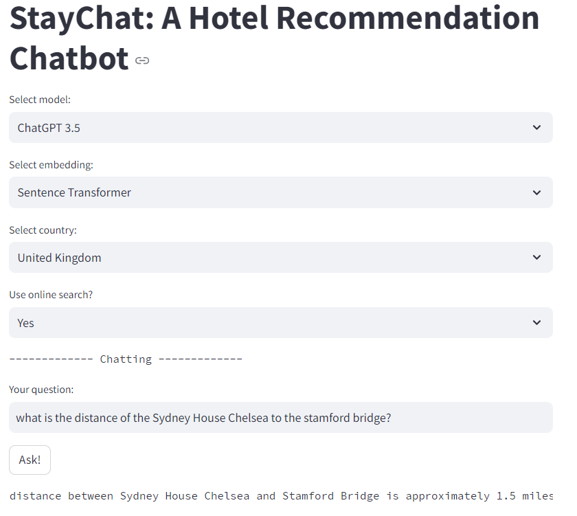
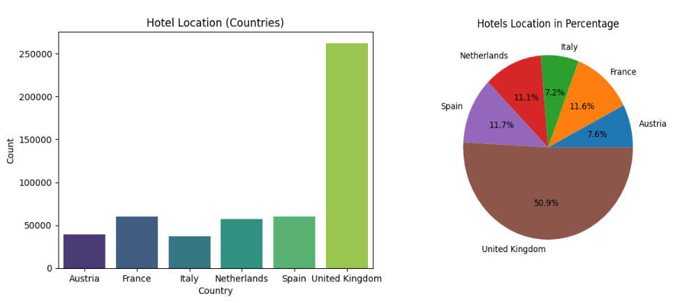
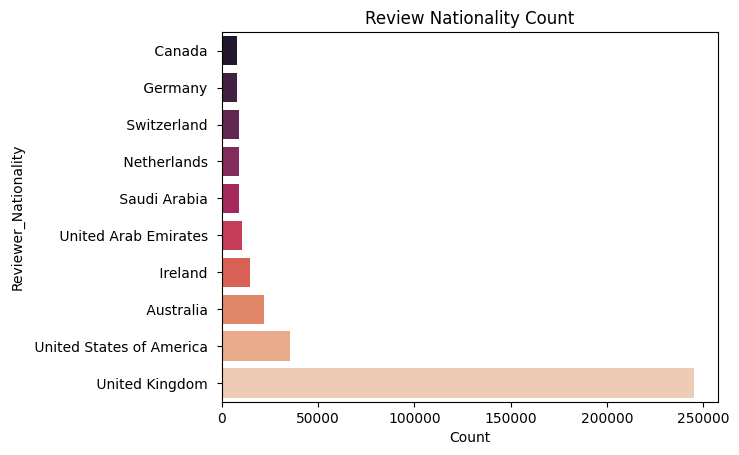
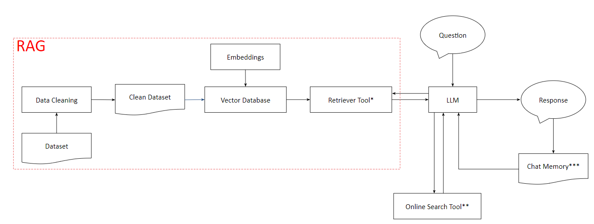
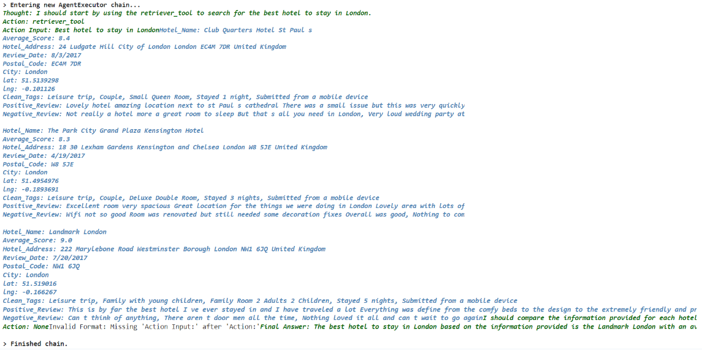
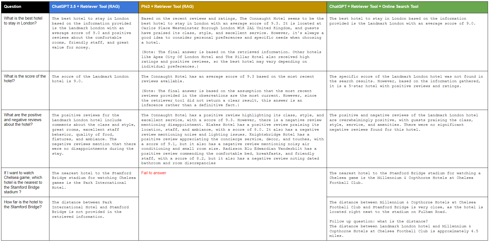

# StayChat: A Hotel Recommendation Chatbot

This project showcases how an AI assistant helps recommending hotels to 
travellers based on travellers' preference.



## Running the App
- The full scripts are located at the `src` folder.  
- The notebooks (demo and exploratory data analysis) are located at the 
`notebook` folder.
- A `.env` file that stores the key for OpenAI API key, HuggingFace API key 
and SerpAPI key is needed to run the app. The `.env` file can be put at the 
  working directory of this project (same level as `src`).

Running the `app.py`:
```commandline
cd src
streamlit run app.py
```


## Data Source
The source of the data to be used as the documents for 
retriever tool is the [515k-hotel-reviews-in-Europe](https://www.kaggle.com/datasets/jiashenliu/515k-hotel-reviews-data-in-europe)


The dataset has more than 500K rows and 17 columns. Some of the most 
important information in the dataset are the hotel's name, hotel's address 
and the reviews of the hotels. 
By consuming these information, the chatbot may provide information based on 
user's preference, such as recommending the hotel according to user's 
travel purpose.

### Exploratory Data Analysis
A simple data analysis on the composition of the hotels location shows that 
most of the hotels are located in the United Kingdom. 50.9% of the hotels in 
the dataset are located in the United Kingdom, whereas others are located 
quite evenly in the Netherlands, Spain, France, Austria and Italy.

|  |
|:--------------------------------------------------------------:| 
|                     Location of the hotels                     |

On top of that, the reviewers' nationality the review the hotels in the 
dataset is dominated by reviewers from the United Kingdom as well.

|  |
|:------------------------------------------------------------------------:| 
|                      Top 10 reviewers' nationality                       |

Seeing that the hotels and reviewers are mostly from the United Kingdom, in 
this project, the focus is to provide recommendation for hotels in the 
United Kingdom and with reviews written by reviewers from the United Kingdom.
The reviews to be inserted as the documents will be the last three 
reviews based on the review date, and they must come from reviewers with 
reviewer score higher than the median, which is reviewer score of 8.


## Development
The development of the chatbot uses Langchain library. In summary, the main 
components of the chatbot are: embedding, vector database, large language 
model (LLM), prompt, and the tools.

|  |
|:--------------------------------------------------------------------:| 
|                          Chatbot components                          |

The dataset (515k-hotel-reviews-in-Europe) is first cleaned. 
The final csv data is fed and saved as the document. The document is 
vectorized, and saved into the vector database. 
This vector database will implement the Retrieval Augmented Generation (RAG) 
for the LLM model. 

An online search tool is also developed, so that extra information that is 
not available in the saved documents can be obtained by searching online. 

|    |
|:-----------------------------------------------------------------:| 
|                   Thinking process by the agent                   |


The ReAct prompt allows the LLM to process the question through a step 
of thinking process before finally providing the final answer to the user. 
This thinking process by the LLM includes the process of selecting suitable 
tool, whether to use the retriever tool that seeks information from the saved 
documents,
or the online search tool that searches information online.

Finally, the chat memory that stores conversations between the user and the 
chatbot is used as the context, which adds extra information to 
answer the question from the user if the user refers to previous 
conversations with the chatbot.

## Results
Three scenarios experimented:
1. Phi3 with RAG (retriever only)
2. ChatGPT 3.5 with RAG (retriever only)
3. ChatGPT 3.5 with retriever and online search tool

Five questions are asked, and the answer from each scenario is as following:

|  |
|:-----------------------------------------------------:| 
|             The answers from the chatbot              |

**Key Findings**
1. The ChatGPT 3.5 + RAG is able to provide answers based on the retrieved 
   documents. However, it fails to answer the question 4 and 5, which ask 
   regarding information not in the documents. When an online search tool is 
   added (last column), the chatbot is able to seek the answer online which 
   finally gives the answer to question 4 and 5
2. The Phi3 model generally gives longer responses, and when the question 4 
   and 5 are asked, the model fails to generate final response. Moreover, 
   the hotel recommended by the Phi3 model is different to the hotel 
   recommended by ChatGPT model.
3. Inconsistency in the answer is noticed, for example, the scenario with 
   ChatGPT + Retriever + Online Search (column 3) is unable to seek the answer 
   from the 
   retrieved documents for question 2, although the same model is able to 
   get the answer when only using retriever tool (column 1)

## Conclusion

1. This project presents the implementation of LLM for chatbot application
    - the chatbot is able to provide answers based on the retrieved documents
    - the online search tool enables the chatbot to seek for answers online


2. Key components of the chatbot are:
   - LLM: ChatGPT 3.5 turbo (paid) and Phi3 (open source)
   - prompts: use ReAct prompting style
   - embedding: use Sentence Transformer
   - vector database: use ChromaDB
   - tools: use retriever and online search tool


3. Some limitations
   - Small language model (SLM) such as the Phi3 model has smaller tokens 
     size, subsequently limits the text input and responses generated by the 
     model
   - Inaccurate usage of the tools provided needs to be fixed
   - The LLM agent may be inconsistent, e.g. asking the same question may 
     trigger different thinking process by the LLM


4. Future improvements
   - Collect more information for the documents, to minimize the LLM agent 
     to search online -- try to reduce the tools used
   - Customize the tools (instead of using standard tool class)
   - Use larger and better model, e.g. ChatGPT 4 or Llama 3 model, if no 
     constraint with financial or computing resource.

Other projects can be seen at: https://github.com/RobyKoeswojo?tab=repositories
